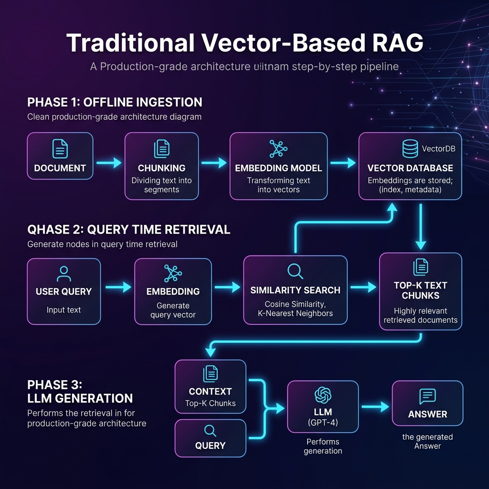
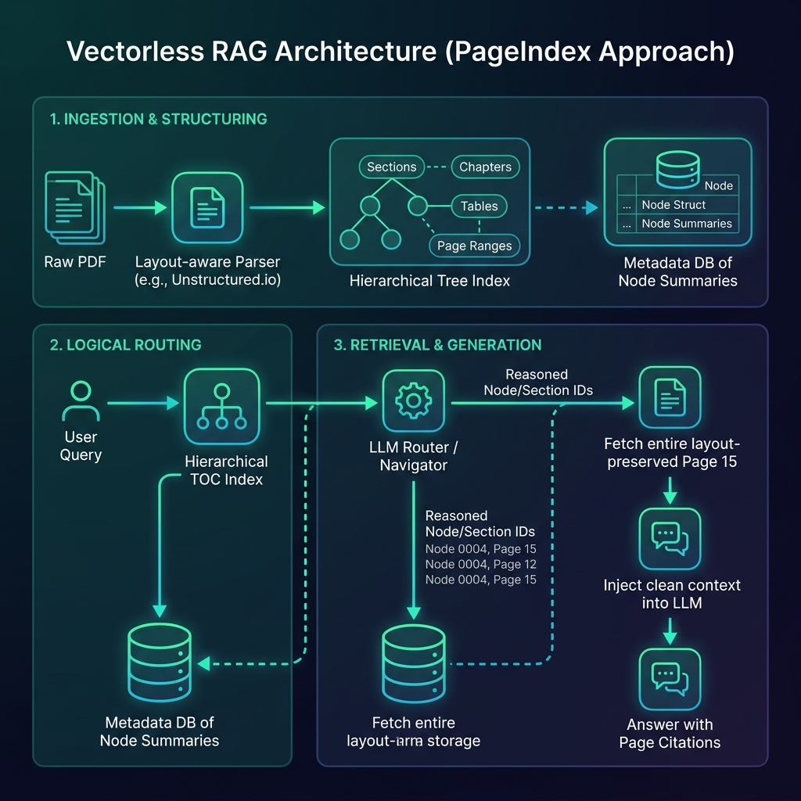

# 📚 Vectorless RAG Architecture Deep Dive

This repository implements and documents a novel approach to Retrieval-Augmented Generation (RAG) known as **Vectorless RAG**. Unlike traditional methods that rely solely on embedding vectors, this advanced system utilizes the intrinsic structural, hierarchical, and logical properties of documents—such as section titles, page layouts, and tables of contents—to perform highly precise and verifiable information retrieval.

This guide serves as a comprehensive reference for understanding Vectorless RAG, its mechanics, comparison to standard vector search, and advanced use cases like expert-guided retrieval.

---

## 💡 What is Vectorless RAG?

**Vectorless RAG (Retrieval-Augmented Generation)** is an alternative retrieval architecture that bypasses the need for high-dimensional vector embeddings and cosine similarity searches entirely. Instead of treating a document as a flat collection of interchangeable text chunks, it treats it as a structured entity with inherent logical relationships.

### How It Works
The core mechanism operates through four integrated stages:

**1. Structural Indexing (Indexing/Ingestion):**
*   **Goal:** To transform the unstructured document into a structured knowledge graph or hierarchical tree index.
*   **Process:** The system uses specialized parsers to break down large documents (e.g., PDFs, long reports) and map their internal structure—identifying distinct sections, subsections, figure captions, and tables of contents (TOC). This preserves the document's logical relationships which are lost during simple chunking.

**2. Query Routing & Node Identification:**
*   **Goal:** To translate a natural language query into specific, locatable coordinates within the index tree, bypassing semantic search entirely.
*   **Process:** The user query and the structural index (TOC) are fed to an LLM. The LLM acts as an expert "navigator," reasoning about which parts of the document's structure (e.g., "Financial Analysis" $\to$ "EBITDA") best answer the question, thus yielding a set of highly relevant *node IDs* or section paths.

**3. Targeted Content Retrieval:**
*   **Goal:** To fetch the *full, raw context* of only the identified nodes from the original document structure.
*   **Process:** Instead of fetching similarity-ranked text chunks, the system uses the retrieved node IDs to retrieve entire sections in their original format, ensuring that headers, surrounding context, and multi-line elements (like complex tables) are kept intact and preserved for accurate LLM grounding.

**4. Generation & Synthesis:**
*   **Goal:** To synthesize a precise, factual answer using *only* the structurally retrieved content.
*   **Process:** The final prompt packages the original query, the context from the specific nodes, and (optionally) expert rules. This guides the LLM to generate an accurate, highly grounded response, enabling direct, verifiable citation of the source section title and page number.

---

## 📈 Technical Deep Dive: Indexing and Parsing Mechanics
Understanding how the index is built (the preprocessing phase) is crucial for using Vectorless RAG effectively, as this process dictates the ultimate structural capabilities of the system.

### A. Structural Component Extraction
The system does not rely on simple text splitting; it uses advanced parsing techniques to identify and segment meaningful components like headings (H1, H2), lists, figure captions, and dedicated data blocks (e.g., tables).

*   **Role of Regular Expressions (Regex):** Python's `re` module is utilized extensively during the ingestion pipeline to pattern-match specific content patterns. For example, identifying a consistent heading format (`# Heading Title`) or extracting structured data fields often requires precise regex matching.
    *   **Use Case:** Defining capturing groups to separate metadata (e.g., `Page X: Section Y on Subject Z`).

### B. The Node Concept
Every piece of semantically relevant information is encapsulated as a 'Node.' A node is not just text; it's a structured object containing:
1.  **`node_id`:** A unique, globally traceable identifier within the document structure (e.g., `Chapter3-Section2-Paragraph5`). This ID is crucial for citation.
2.  **`raw_context`:** The original, unedited text chunk/section content.
3.  **`metadata`:** Associated data like page number, surrounding headers, and section type (e.g., `type: 'figure'`).

### C. Indexing Workflow Summary
The process follows these steps:
1.  **Parse & Segment:** Raw document $\to$ Structural Components (Nodes).
2.  **Metadata Tagging:** Each node is enriched with positional data and structural parent/child relationships.
3.  **Index Generation:** The nodes are organized into the final `PageIndex` object, forming a searchable tree structure that maps logical flow rather than just physical text proximity.

---

## 🆚 Vectorless RAG vs. Traditional (Vector-Based) RAG

The difference between these two approaches is fundamental—it’s the difference between semantic guesswork and deterministic structural navigation.

| Feature | Traditional (Vector-based) RAG | Vectorless RAG (PageIndex Approach) |
| :--- | :--- | :--- |
| **Core Mechanism** | Semantic Similarity Search (Cosine Distance). | Logical Structure Traversal, Expert Routing, or Lexical Indexing (BM25). |
| **Data Preparation** | Flat list of fixed-size text chunks. | Hierarchical tree structure (Sections $\to$ Subsections $\to$ Pages). |
| **Search Paradigm** | Fuzzy and conceptual (Find "what's similar"). | Exact, structured, deterministic (Find "where X is located"). |
| **Context Integrity** | Low risk of context loss; chunking can break tables or split related ideas across boundaries. | High integrity; retrieves entire sections/pages in original layout, preserving structure. |
| **Explainability** | Poor. Answer is based on a mathematical score (low explainability). | Excellent. The LLM cites the specific `Section Title` and `Page Number`. |
| **Domain Expertise** | Requires *fine-tuning* of embedding models to recognize niche jargon or codes. | Achieved by adding **rules to the prompt** (`Expert Rules`)—instant adaptation without retraining. |
| **Best For** | Large, flat collections (e.g., transcripts, general articles). | Long, structured documents (Manuals, legal contracts, financial reports). |



---

## 🏗️ Detailed Architectural Flow and Mechanics

### 1. The Traditional Vector RAG Flow (The Limitation)
*   **Input:** Document $\xrightarrow{\text{Chunking}}$ Fixed Chunks $\xrightarrow{\text{Embedding Model}}$ Vectors $\xrightarrow{\text{Vector DB Search}}$ Top-K Chunks $\xrightarrow{\text{LLM Context}}$ Answer.
*   **Challenge:** The process is vulnerable to poor chunk boundaries, which can detach context (e.g., headers and body text being separated) or fail to capture the structural relationship necessary for complex reasoning tasks like reading financial tables.

### 2. The Vectorless RAG Flow (The Solution: PageIndex)
*   **Ingestion:** PDF $\xrightarrow{\text{Structural Parser}}$ Hierarchical Tree Index (TOC/Sections).
*   **Query Time (The Core Leap):** Instead of a vector similarity search, the query and the structural index are passed to an LLM. The LLM acts as an expert "Table of Contents navigator," performing complex reasoning over available section titles and summaries to pinpoint the most relevant *node IDs*.
*   **Retrieval:** Document Structure Service $\xrightarrow[\text{IDs}]{\text{Fetch Raw Content}}$ Full Sections.
*   **Generation:** LLM (Prompted with structured nodes) $\to$ Grounded Answer with Citations.

---

## 🚀 Advanced Capabilities in the System

### A. Expert-Guided Retrieval (The Killer Feature)
This capability allows the system to incorporate external, domain-specific knowledge into the retrieval process without requiring model retraining. Instead of relying solely on semantic similarity, we provide hard constraints and guidance rules:

**Implementation:** The LLM prompt is augmented with an `Expert Rules` block:
```markdown
"If the query mentions EBITDA → prioritize the MD&A section"
"If the query is about risks → check Part I, Item 1A"
```
The LLM uses this expert knowledge to restrict its search *before* retrieving any content, ensuring focus on mandated areas.

### B. Multi-turn Conversational Chat API
When building a simple Q&A product and managing full chat history is critical:
*   PageIndex provides an integrated `chat_completions` endpoint that maintains the context (conversation history) automatically, making it ideal for multi-step questioning without needing complex state management in your application logic.

### C. Self-Hosting Option
For maximum data privacy and control, the system can be run fully self-hosted using open-source implementations. This allows users to:
1. Clone the necessary repository.
2. Set up environment variables (e.g., `CHATGPT_API_KEY`).
3. Run the indexing script locally on any PDF file.

---

## 🛠️ Quick Start Reference Guide

### 1. Prerequisites & Setup
1. Install UV package manager (In Powershell execute this command): `powershell -ExecutionPolicy ByPass -c "irm https://astral.sh/uv/install.ps1 | iex"`
2. uv init
    - This will create the gitignore, python version info, pyproject.toml
3. uv venv
    - This will create the virtual environment for the project at `.venv\Scripts\activate`
4. Activate vEnv
    - `.venv\Scripts\activate`
5. uv add -r requirements.txt

## API Keys
1. Google API Key: https://aistudio.google.com/app/api-keys?project=gen-lang-client-0348637965
    - Create API Key and place it in .env file "GOOGLE_API_KEY"
2. Groq API Key: https://console.groq.com/keys
    - Create API Key and place it in .env file "GROQ_API_KEY"
3. OpenAI API Key: https://platform.openai.com/api-keys
    - Create API Key and place it in .env file "OPENAI_API_KEY"
4. __PageIndex (VectorLess RAG Service)__ https://developer.pageindex.ai/api-keys
    - Create API Key and place it in .env file "PAGEINDEX_API_KEY"

### 2. Indexing a Document
Use the client library to upload your PDF path:
```python
# document_path = "./pdfs/my_technical_manual.pdf"
result = pi_client.submit_document(document_path)
doc_id = result["doc_id"]
```
**Note:** This process builds a complete, structured map of the document, replacing simple text chunking with intelligent section indexing.

### 3. Performing a Query (End-to-End Pipeline)
The core function chains three steps:
1.  `llm_tree_search(query, tree, model)`: LLM reasons over the structure to get `node_list`.
2.  `find_nodes_by_ids(tree, node_list)`: Retrieves the raw context blocks for those nodes.
3.  `generate_answer(query, nodes, model)`: Generates a grounded response with citations.

### 4. Project Command Reference (Self-Hosted)
```bash
# 1. Clone and Install
git clone https://github.com/VectifyAI/PageIndex.git
cd PageIndex
pip install -r requirements.txt

# 2. Set up .env file with CHATGPT_API_KEY={your_key}

# 3. Run Indexer
python run_pageindex.py --pdf_path /path/to/your/document.pdf ...

# 4. Run Retrieval Test
python run_pageindex.py --load-local-tree <json_path>
```

***
*Built by integrating advanced document structure analysis into the RAG pipeline.*